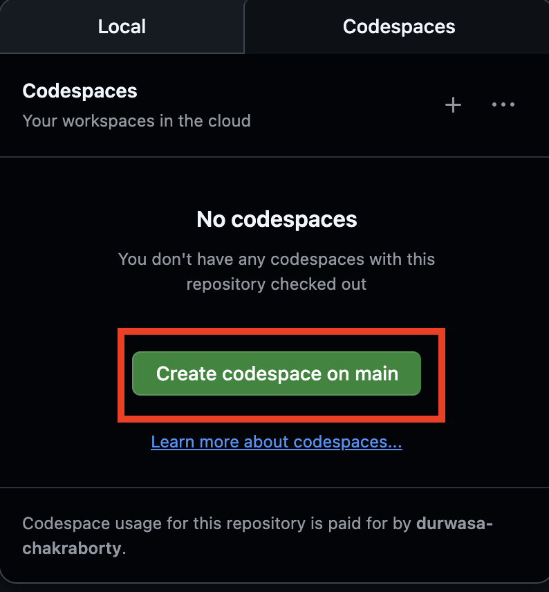

## Learn OCaml Workshop 2026

### Introduction to Functional Programming in OCaml

This workshop will teach participants the basics of programming in OCaml through
a series of small exercises [developed from](https://github.com/kayceesrk/learn-ocaml-workshop-2024)

Pre-requisites:
- [Docker](https://docs.docker.com/get-started/get-docker/)
- [Visual Studio Code](https://code.visualstudio.com/Download)
- [Git](https://git-scm.com/install)

Instructions:
1. Clone the repository with exercises with:
    `git clone  https://github.com/fplaunchpad/learn-ocaml-workshop-2026`

2. Start Docker

3. Open Visual Studio, then navigate to "File -> Open Folder...

4. Open the directory cloned in step 1.

5. Click "Reopen in Container" when prompted

6. A VS Studio Terminal instance should open with the `exercises` folder.

7. Please navigate to each folder and run: `dune runtest`. The exercises
   are set to indicate where failures occur as a prompt for you.

   Look at error indicated for each `.ml` exercise. Open the `problem.ml` file
   for that error and think of what can be done to fix it.

Have fun and please ask a tutor for help if you have problems with any of the
above steps.

If you are not done with all the exercises by the time workshop ends, beginners
are always welcome at [OCaml Discord Beginners channel](https://discord.gg/vS5NqRZy)
for help, questions or explore what's happening in the OCaml world.

#### Using GitHub Codespaces (no local setup required)

If you have free tier credits available on your GitHub account, you can complete
the workshop entirely in the browser — no Docker or local installation needed.

1. Click the **Code** button at the top of this repository page.

   

2. Select the **Codespaces** tab, then click **Create codespace on main**.

   

3. VS Code will launch in your browser with the full toolkit already installed —
   you can dive straight into the exercises.

> **Note:** GitHub Free accounts include 60 core-hours of Codespaces.
> The workshop should fit comfortably within this limit.

#### Useful Links:
- [Library
  documentation](https://ocaml.janestreet.com/ocaml-core/v0.12/doc/base/Base/index.html)
- [Links to other tutorials](https://ocaml.org/docs)
- [Dune - a tool for building OCaml programs](https://dune.build/)
- [A general overview of OCaml](https://ocaml.org/about)
- [The OCaml community](https://ocaml.org/community)

